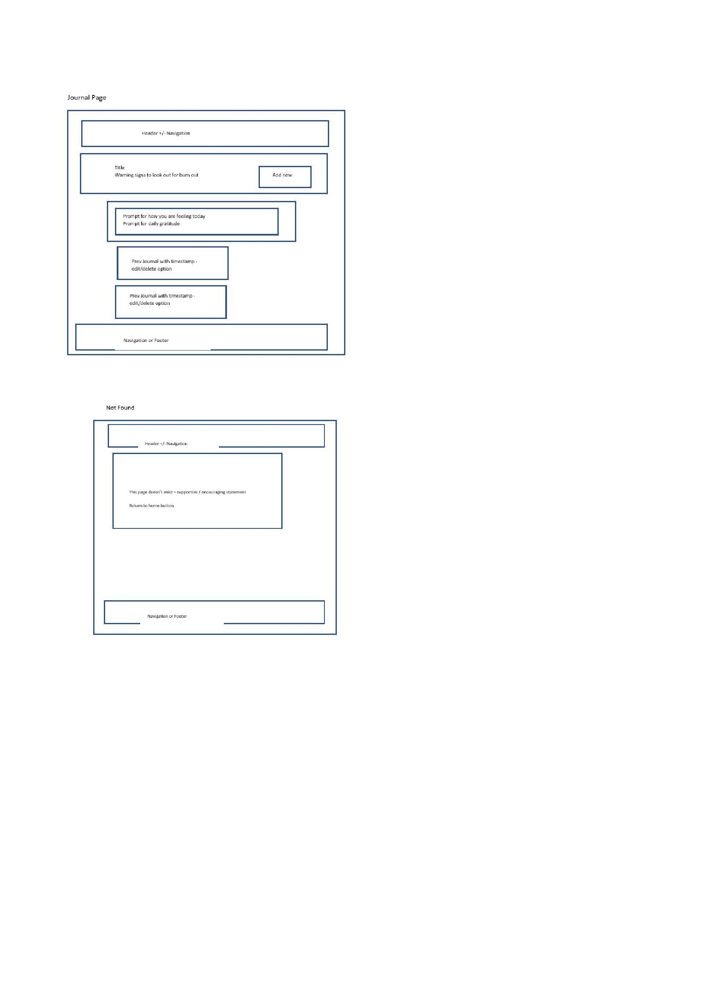
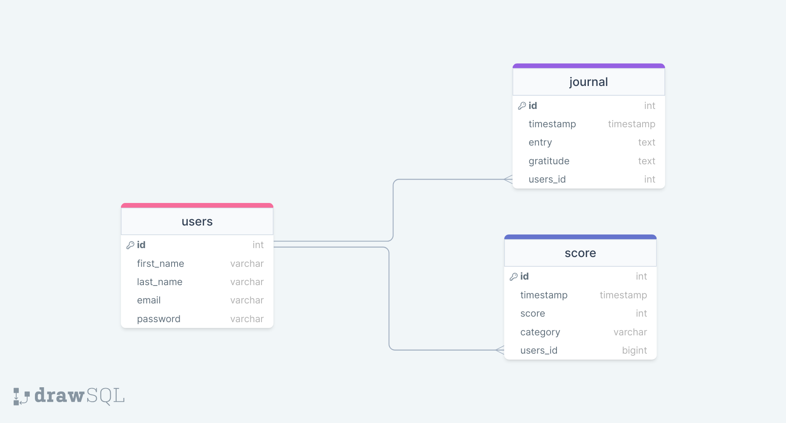

# Project Title

MindEase

## Overview

MindEase is a guide to mental wellness, helping you recognise the signs of burnout early so you can take proactive steps to maintain balance and well-being.

### Problem

In today's fast-paced world, burnout has become a prevalent issue affecting individuals across various industries and demographics. The demanding nature of modern work environments, coupled with societal pressures and personal responsibilities, often leads to chronic stress, exhaustion, and ultimately, burnout. However, despite its widespread impact, burnout is often overlooked or misunderstood, resulting in detrimental effects on individuals' mental, emotional, and physical health.

Ultimately, by promoting early intervention and holistic well-being, a mental health app on burnout plays a crucial role in safeguarding individuals' overall health and quality of life.

### User Profile

The user profile for the mental health app focused on burnout can encompass a diverse range of individuals who may be susceptible to or experiencing symptoms of burnout.

- Individuals working in demanding industries such as finance, healthcare or education

- High achievers, executives, entrepreneurs or freelancers facing intense work pressures and long hours

- Remote workers navigating the challenges of remote work, isolation and blurred work-life boundaries

### Features

- Sign up for an account

- Log into my account if an existing user

- Complete a questionnaire on wellbeing and burn out

- Display a graph of my scores over time to have a visual representation of my pattern of mental health

- Write journal entries in the app

- See, edit and delete previous journal entries

## Implementation

### Tech Stack

- React

- MySQL

- Node/Express

- Client libraries:

  - react

  - react-router

  - axios

  - sass

  - chart.js

     - react-chartjs-2

 - react-slick

- markdown-to-jsx

- react-loading-skeleton

- Server libraries:

  - knex

  - express

  - dotenv

  - mysql2

  - cors

    - bycrypt

    - jsonwebtoken

### APIs

No third party API shall be used

### Sitemap

- Welcome page

- Sign up page

- Log in page

- Home page

- Mental health check in page

- Mental health graph page

- Journal page

- Not found page

### Mockups




### Data



### Endpoints

**POST /users/register**

Create an account for the app

Route --> userRoute, 400 if missing request body, 201 if sucessful, 500 if server error

Parameters:

- first_name: first name

- last_name: last name

- email: email

- password: user's provided password

Response:

```

{

- id: id

- first_name: first name

- last_name: last name

- email: email

- password: user's bcrypt password

}

```

**POST/ users/login**
Log into the app

Route --> userRoute, 404 if user is not found, 200 if sucessful, 500 if server error

- email: email

- password: user's provided password

Response:

```

{

"token": "seyJhbGciOiJIUzI1NiIsInR5cCI6IkpXVCJ9.eyJzdWIiOiIxMjM0NTY3ODkwIiwibmFtZSI6I..."

}

```

**GET/ users**
Get user information in the app

Route --> userRoute, 404 if user is not found, 200 if sucessful, 500 if server error

Response:

```

{

- id: id

- first_name: first name

- last_name: last name

- email: email

}

```

**POST /score**

Complete burn out questionnaire

Route --> scoreRoute, 400 if missing request body, 201 if sucessful, 500 if server error

Response:

```

[

{

"id": 1,

"timestamp: "29/03/202024 14:12",

"score": "30",

"category": "high",

"user_id": 1,

}...

]

```

**GET /score**

See previous scores from burn out questionnaire

Route --> scoreRoute, 200 if sucessful, 500 if sever error

Response:

```

[

{

"id": 1,

"timestamp: "29/03/202024 14:12"

"score": "30"

"category": "high"

"user_id": 1,

}...

]

```

**POST / journal**

Enter a journal entry

Route --> journal, 400 if missing request body, 201 if sucessful, 500 if server error

Response:

```

[

{

"id": 1,

"timestamp: "timestamp"

"entry": "entry"

"gratitude": "gratitude"

"user_id": 1,

}...

]

```

**GET / journal**

See previous journal entries

Route --> journal, 200 if sucessful, 500 if sever error

Response:

```

[

{

"id": id,

"timestamp: "timestamp"

"entry": "entry"

"gratitude": "gratitude"

"user_id": 1,

}...

]

```

**PATCH / journal/:id/entry**

Edit previous journal entry

Route --> journal, 404 if journal entry not found, 400 if missing request body, 200 if sucessful, 500 if server error

Response:

```

[

{

"id": id,

"timestamp: "timestamp"

"entry": "entry"

"gratitude": "gratitude"

"user_id": 1,

}...

]

```

**DELETE / journal/:id**

Delete previous journal entry

Route --> journal, 404 if journal entry not found, 204 if sucessful, 500 if server error

Response:

```

[

{

"id": uuid,

"timestamp: "timestamp"

"entry": "entry"

"gratitude": "gratitude"

"user_id": 1,

}...

]

```

### Auth

One has to have an account and be signed into the app to be able to use it. Only the user can access their information.

## Roadmap

- Create client folder and file structure: React project with routes and boilerplate pages, style and partials, assets
- Feature server folder and file structure: Set up index.js page, route folder and files, controller folder and files

- Feature client side: Welcome page including global component of the button

- Feature client side: Create an account page with form validation

- Feature server side: Register user POST

- Feature client side: Log in page with form validation

- Feature server side: Log in user authentication

- Feature client side: Home Page including global component of the navigation bar

- Feature client side: Journal page including list of previous journal entries and form to post journal entry

- Feature server side: Journal page including GET, POST, PATCH, DELETE

- Feature client side: Integrate sever side with client side of journal page (should be fully styled and functioning)

- Feature client side: Mood form page with form validation

- Feature server side: Mood form page POST

- Feature client side: Integrate sever side with client side of mood form page (should be fully styled and functioning)

- Feature client side: Mood chart page

- Feature server side: Mood chart page GET

- Feature client side: Integrate server side with client side of mood chart page (should be fully styled and functioning)

- Feature client side: Not found page

- Deployment

## Nice-to-haves

- Animation

- Add toggle for dark theme

- Loading page skeleton

- General resources page using 3rd party API (e.g. NHS)

- Personalised coping strategies

- Personalised crisis support page

- User can edit their information and delete their account
